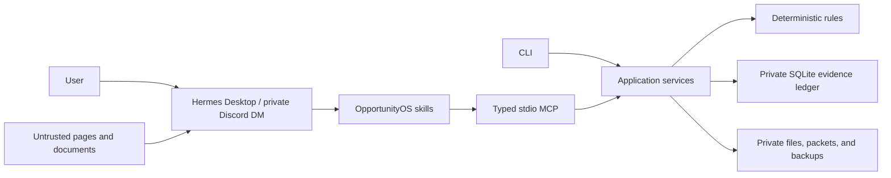

# OpportunityOS

[](https://github.com/ChimdumebiNebolisa/OpportunityOS/actions/workflows/ci.yml)
[](https://github.com/ChimdumebiNebolisa/OpportunityOS/actions/workflows/security.yml)
[](https://www.python.org/downloads/)
[](LICENSE)

**A local-first, evidence-backed opportunity intelligence system for Hermes Agent.**

OpportunityOS turns scattered opportunity links, documents, and profile evidence into auditable
decisions and grounded application packets. Hermes handles conversation, search, and untrusted
interpretation; OpportunityOS owns private storage, canonical facts, deterministic eligibility,
ranking, and audit history.

It is designed for one person running it on their own computer. It never submits an application,
sends a message, accepts terms, makes a purchase, or deletes remote data.

## What it does

- Builds a provenance-backed profile from user statements, documents, ChatGPT snapshots, and
  observable GitHub metadata.
- Keeps conflicts visible for human review instead of silently overwriting facts.
- Captures opportunities and verifies requirements against official sources.
- Computes eligibility, value, confidence, and the next best action with deterministic rules.
- Compiles seven private, evidence-linked application artifacts without submitting them.
- Gives Hermes bounded scout state with budgets, quiet runs, and duplicate-delivery protection.
- Exposes the same application services through a CLI and a typed stdio MCP server.

## Quick start

Requirements:

- Python 3.11 or newer
- Git
- Windows PowerShell, or a POSIX shell on macOS/Linux

### Windows

```powershell
git clone https://github.com/ChimdumebiNebolisa/OpportunityOS.git
Set-Location OpportunityOS
.\scripts\setup.ps1
```

### macOS or Linux

```sh
git clone https://github.com/ChimdumebiNebolisa/OpportunityOS.git
cd OpportunityOS
sh scripts/setup.sh
```

The setup script creates `.venv`, installs the locked dependencies, initializes the private data
directories and database, and runs `opportunityos doctor`. Hermes, Discord, OAuth, and optional
GitHub authentication remain clearly marked `GATED` until you configure them.

To check the installation again on Windows:

```powershell
.\.venv\Scripts\opportunityos.exe doctor
.\.venv\Scripts\opportunityos.exe status
```

## Try the offline demo

On a fresh installation, seed a complete synthetic workflow without network access or real personal
data:

```powershell
.\.venv\Scripts\python.exe scripts\seed_synthetic_demo.py
.\.venv\Scripts\opportunityos.exe queue
.\.venv\Scripts\opportunityos.exe next
```

The demo writes visibly synthetic records to the same private application-data location used by the
installed CLI. Its final JSON includes the generated opportunity, evaluation, action, application,
and packet path, with `external_submission_performed` set to `false`.

## Connect Hermes

OpportunityOS is the deterministic backend; Hermes Desktop or a private Discord DM is the intended
conversational interface.

1. Install Hermes and complete OpenAI Codex device-code authentication.
2. Merge the MCP entry from [`examples/hermes-config.example.yaml`](examples/hermes-config.example.yaml)
   into your private Hermes configuration.
3. Run `hermes mcp list` and `hermes mcp test opportunityos`.
4. Copy the six directories under [`skills/`](skills/) into your private Hermes skills directory.
5. Test profile sync and opportunity intake in Hermes Desktop before enabling Discord or scouts.

The complete instructions are in [Hermes setup](docs/HERMES_SETUP.md) and
[Discord setup](docs/DISCORD_SETUP.md). These steps are manual because they create external accounts,
tokens, OAuth grants, or background services.

## Typical CLI operations

| Goal | Command |
| --- | --- |
| Inspect health and integration gates | `opportunityos status` |
| Import a profile snapshot | `opportunityos profile import snapshot.json` |
| Record observable GitHub evidence | `opportunityos profile sync-github USERNAME` |
| Cache a file, URL, or text as untrusted input | `opportunityos ingest INPUT` |
| View the human review inbox | `opportunityos review list` |
| Rank actions that fit a time budget | `opportunityos queue --minutes 45` |
| Select one next action | `opportunityos next --minutes 45` |
| Compile an application packet | `opportunityos prepare OPPORTUNITY_ID` |
| Create a verified private backup | `opportunityos backup` |
| Audit the checkout before publishing | `opportunityos audit public-repo` |

Run `opportunityos --help` or `opportunityos COMMAND --help` for the complete command reference.

## How trust is divided



Hermes may propose observations, assessments, and drafts. Only OpportunityOS application services
can mutate canonical truth. Every user-facing recommendation is structured around a decision, an
official source, supporting evidence, a risk or unknown, and one next human step.

An application becomes `READY` only when the official source was verified within 24 hours, the
requirements are complete, deterministic eligibility is current, the deadline is still open, and
all grounded packet artifacts are present and unchanged. `READY` means ready for **human review and
manual submission**.

## Privacy and safety

Runtime databases, attachments, source caches, logs, backups, exports, and packets live outside the
repository in operating-system application-data directories. Secrets are never required in the
checkout.

- Treat imported files and web pages as untrusted data.
- Use a private Discord DM with a numeric user allowlist.
- Keep Hermes OAuth files, Discord bot tokens, and optional GitHub tokens outside this repository.
- Run `opportunityos audit public-repo` before every push.
- Back up before migrations and restore only into an empty private target.

Read [Security](SECURITY.md), [Privacy](PRIVACY.md), and the
[Threat model](docs/THREAT_MODEL.md) before using real personal documents.

## Documentation

| Topic | Guide |
| --- | --- |
| Architecture and trust boundaries | [Architecture](docs/ARCHITECTURE.md) |
| Hermes MCP, OAuth, and skills | [Hermes setup](docs/HERMES_SETUP.md) |
| Private Discord configuration | [Discord setup](docs/DISCORD_SETUP.md) |
| Profile imports and GitHub evidence | [Profile import](docs/PROFILE_IMPORT.md) |
| Scoring and decision rules | [Scoring](docs/SCORING.md) |
| Backups, restores, exports, and retention | [Operations](docs/OPERATIONS.md) |
| Errors and blocked `READY` states | [Troubleshooting](docs/TROUBLESHOOTING.md) |
| Product requirements | [PRD](docs/PRD.txt) |

## Development

Install the locked development environment, then run the same checks as CI:

```sh
uv sync --all-extras --frozen
uv run ruff format --check .
uv run ruff check .
uv run mypy src
uv run pytest --cov=opportunityos --cov-fail-under=80
uv run python scripts/audit_public_repo.py
uv build
```

See [Contributing](CONTRIBUTING.md) for project conventions. OpportunityOS is released under the
[MIT License](LICENSE).
