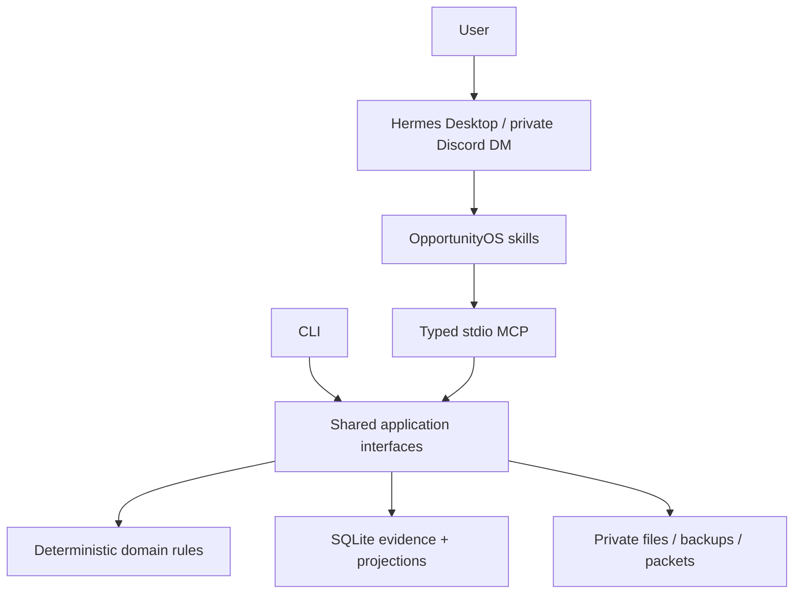

# OpportunityOS

OpportunityOS is a single-user, local-first opportunity intelligence and execution system for Hermes Agent. Hermes interprets and searches; OpportunityOS preserves evidence, reconciles profile truth, evaluates eligibility, ranks next actions, and compiles grounded private application packets.

The repository is public-safe by design. Runtime databases, attachments, source caches, logs, backups, and packets default to the operating system's private application-data directories. OpportunityOS never submits applications, sends messages, accepts terms, or purchases services.

## Quick start

```powershell
git clone https://github.com/ChimdumebiNebolisa/OpportunityOS.git
cd OpportunityOS
py -3.12 -m venv .venv
.venv\Scripts\python -m pip install uv
.venv\Scripts\uv sync --all-extras --frozen
.venv\Scripts\opportunityos setup
.venv\Scripts\opportunityos doctor
```

Continue with [Hermes setup](docs/HERMES_SETUP.md) and [Discord setup](docs/DISCORD_SETUP.md). External authentication is an explicit manual gate.

## Architecture



The response grammar is always: decision, official source, evidence, risk or unknown, and one next human step.

## Current limitations

- The laptop and Hermes gateway must be awake for immediate Discord intake and scheduled scouts.
- Hermes ChatGPT/Codex OAuth, Discord credentials, and optional GitHub authentication require user interaction.
- Dynamic or login-walled official pages may remain REVIEW REQUIRED until Hermes browser verification succeeds.
- ChatGPT OAuth provides model access; it does not grant access to private ChatGPT memory or history.

## Cost model

The default runtime uses Hermes' OpenAI Codex provider through ChatGPT device-code OAuth, free DDGS search, and local extraction. Hermes' current documentation does not define how every ChatGPT plan quota is consumed, so OpportunityOS records observable calls rather than inventing token or dollar estimates. Paid providers and credits are never enabled or purchased silently.

## Safety

- Send screenshots, PDFs, documents, URLs, text, and voice-derived transcripts through a private Discord DM only after configuring Hermes' numeric user allowlist.
- Authorized Discord users have agent tool access; protect the bot token and account.
- Run `opportunityos audit public-repo` before every push.
- See [Security](SECURITY.md), [Privacy](PRIVACY.md), and the [Threat model](docs/THREAT_MODEL.md).
