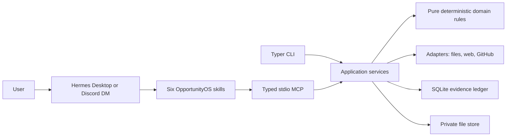

# Architecture

OpportunityOS is a modular monolith with two transport surfaces and one application layer.

## Responsibilities

- `domain` owns profile reconciliation, eligibility predicates, scoring, priority, and lifecycle
  transitions. It has no database, filesystem, network, Hermes, or UI dependency.
- `application` owns transactions and workflows. Every CLI and MCP operation calls these services.
- `adapters` isolate network and document parsing behind bounded, validated inputs.
- `infrastructure` owns private path containment, SQLAlchemy models, SQLite pragmas, and migrations.
- `mcp` validates typed arguments and returns a stable `{ok,data,error}` envelope.
- `skills` teach Hermes the workflow. Skills use MCP tools only for OpportunityOS state and treat
  retrieved content as untrusted data.

The system stores observations append-only, derives canonical facts deterministically, persists each
evaluation with input versions, and writes audit events for material decisions. Subjective model
assessments are validated inputs; eligibility, score math, thresholds, lifecycle, and queue ordering
remain code.

## Conversational surface

There is intentionally no separate custom GUI. Hermes owns conversation and Discord transport. A
response follows one hierarchy: **decision → official source → evidence → risk/unknown → one next
human step**. The same fields appear in CLI JSON and application decision briefs.

## Trust boundaries

The repository is public, runtime state is private, the network is hostile, source text is
untrusted, model output is fallible, and external side effects require a human. See
[THREAT_MODEL.md](THREAT_MODEL.md).
